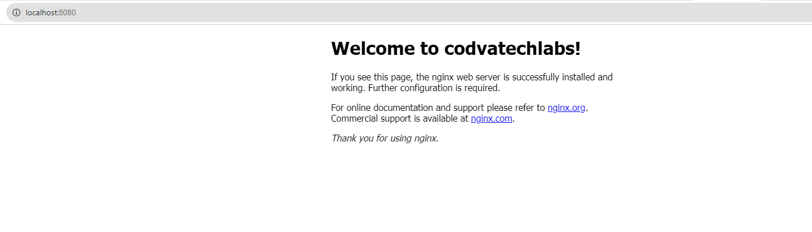
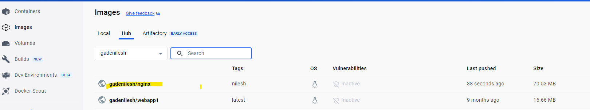

Login to Docker for Desktop and Docker hub

1) docker
This command will output a list with all options available for the docker command 
together with a short description.

Example : docker 

2)docker version
This command will output a current docker version.

Example : docker --version 

Selecting An Image
Now that Docker is up and running we’re ready to select an image so that 
we’re able to run our first docker container. 
To select from the list of already existing Docker images go to docker hub portal.
https://hub.docker.com/

3) docker pull
This command is used to pull images from the docker repository(hub.docker.com)
Example : 
docker pull nginix

Output : 
docker pull httpd 
Using default tag: latest
latest: Pulling from library/httpd
66dbba0fb1b5: Already exists 
010da4e05daa: Pull complete 
c036f6f9865d: Pull complete 
3c1643a8fc21: Pull complete 
07102ce9b5e9: Pull complete 
Digest: sha256:f5556d859f39f6019651b7bdf2dbe9a16b00962e7baa75f873a82f6eb8efc84d
Status: Downloaded newer image for httpd:latest
docker.io/library/httpd:latest

NIlesh:
Docker pull httpd
docker pull httpd:alpine3.19

diff between them

docker pull nginix

4) Docker images
C:\Users\gaden>docker images
REPOSITORY                    TAG          IMAGE ID       CREATED        SIZE
httpd                         alpine3.19   14e4a81abb0d   14 hours ago   61.5MB
ctlwebhttpd                   latest       872a64e8350e   17 hours ago   169MB
nginx                         latest       a6bd71f48f68   3 weeks ago    187MB
gcr.io/k8s-minikube/kicbase   v0.0.40      c6cc01e60919   5 months ago   1.19GB

C:\Users\gaden>docker rmi httpd:alpine3.19
Untagged: httpd:alpine3.19
Untagged: httpd@sha256:b75d9b54cd9709f5ae8bd72b845524f5f706c292a83d1e52bdfb4d8b76099040
Deleted: sha256:14e4a81abb0d83d914116e2944847e25a75358a1a802a1ee71a6aeb1ca3c9738
Deleted: sha256:6b33e222ccde984a615f33b5c64f96cfc223ac5890da93161a676f63a38d3c45
Deleted: sha256:6d817a2933d9a601a664bc64d72e8c503f16cc6d089e4eb11432b83788ffe569
Deleted: sha256:8a71ed96e11a07eb7b608d9b98cb28acd9518f827ea6e91b9959514a481585de
Deleted: sha256:811093125f1a48979e8105a60b467496538047c3b4c69d47d9e13f0b1ba92573
Deleted: sha256:49e67bcca11ebb07b280cddc8839f3eef5cbabc2ba96cdcb7a30d71f9673d27f
Deleted: sha256:5af4f8f59b764c64c6def53f52ada809fe38d528441d08d01c206dfb3fc3b691

C:\Users\gaden>

4) docker run
There is a shortcut for building a container from an image and running it with the
docker run command. This will create a new container for an image and run it.

Example : 

docker run -d -p 80:80 nginx
d75e61fcad1e0c0eca69a3f767be6ba28a66625ce4dc42201a8a323e8313c14e

Assigning Container Names
C:\Users\gaden>docker run -d -p 8080:80 --name web1 nginx
632a8c730bc9397ffc95615e341967c3e08d68cda8c8b487478fff2f75452737

C:\Users\gaden>docker run -d -p 8081:80 --name web2 nginx
799e368fd48ab3d72447cfcff47d6d089c2c754f11dcefbbccb6a6e97ea08f34

5) docker ps
This command is used to list the running containers
Example: docker ps
C:\Users\gaden>docker ps
CONTAINER ID   IMAGE                                 COMMAND                  CREATED              STATUS              PORTS
                                             NAMES
799e368fd48a   nginx                                 "/docker-entrypoint.…"   8 seconds ago        Up 6 seconds        0.0.0.0:8081->80/tcp
                                             web2
632a8c730bc9   nginx                                 "/docker-entrypoint.…"   About a minute ago   Up About a minute   0.0.0.0:8080->80/tcp
                                             web1
23e7ea65ee6e   nginx                                 "/docker-entrypoint.…"   2 minutes ago        Up 2 minutes        0.0.0.0:80->80/tcp
                                             

Usage: docker ps -a
This command is used to show all the running and exited containers
C:\Users\gaden>docker ps
CONTAINER ID   IMAGE                                 COMMAND                  CREATED         STATUS         PORTS                                                                                                                                  NAMES
799e368fd48a   nginx                                 "/docker-entrypoint.…"   3 minutes ago   Up 2 minutes   0.0.0.0:8081->80/tcp                                                                                                                   web2
632a8c730bc9   nginx                                 "/docker-entrypoint.…"   4 minutes ago   Up 4 minutes   0.0.0.0:8080->80/tcp                                                                                                                   web1
23e7ea65ee6e   nginx                                 "/docker-entrypoint.…"   4 minutes ago   Up 4 minutes   0.0.0.0:80->80/tcp                                                                                                                     admiring_lederberg
51de5f58ac6f   gcr.io/k8s-minikube/kicbase:v0.0.40   "/usr/local/bin/entr…"   7 weeks ago     Up 18 hours    127.0.0.1:59732->22/tcp, 127.0.0.1:59733->2376/tcp, 127.0.0.1:59730->5000/tcp, 127.0.0.1:59731->8443/tcp, 127.0.0.1:59729->32443/tcp   minikube

C:\Users\gaden>docker stop 799
799

C:\Users\gaden>docker ps
CONTAINER ID   IMAGE                                 COMMAND                  CREATED         STATUS         PORTS                                                                                                                                  NAMES
632a8c730bc9   nginx                                 "/docker-entrypoint.…"   4 minutes ago   Up 4 minutes   0.0.0.0:8080->80/tcp                                                                                                                   web1
23e7ea65ee6e   nginx                                 "/docker-entrypoint.…"   5 minutes ago   Up 5 minutes   0.0.0.0:80->80/tcp                                                                                                                     admiring_lederberg
51de5f58ac6f   gcr.io/k8s-minikube/kicbase:v0.0.40   "/usr/local/bin/entr…"   7 weeks ago     Up 18 hours    127.0.0.1:59732->22/tcp, 127.0.0.1:59733->2376/tcp, 127.0.0.1:59730->5000/tcp, 127.0.0.1:59731->8443/tcp, 127.0.0.1:59729->32443/tcp   minikube

C:\Users\gaden>docker ps -a
CONTAINER ID   IMAGE                                 COMMAND                  CREATED         STATUS                      PORTS                                                                                                                                  NAMES
799e368fd48a   nginx                                 "/docker-entrypoint.…"   3 minutes ago   Exited (0) 14 seconds ago                                                                                                                                          web2
632a8c730bc9   nginx                                 "/docker-entrypoint.…"   4 minutes ago   Up 4 minutes                0.0.0.0:8080->80/tcp                                                                                                                   web1
23e7ea65ee6e   nginx                                 "/docker-entrypoint.…"   5 minutes ago   Up 5 minutes                0.0.0.0:80->80/tcp                                                                                                                     admiring_lederberg
51de5f58ac6f   gcr.io/k8s-minikube/kicbase:v0.0.40   "/usr/local/bin/entr…"   7 weeks ago     Up 18 hours                 127.0.0.1:59732->22/tcp, 127.0.0.1:59733->2376/tcp, 127.0.0.1:59730->5000/tcp, 127.0.0.1:59731->8443/tcp, 127.0.0.1:59729->32443/tcp   minikube

C:\Users\gaden>
6) docker exec

usecase
instead of default page "Welcome to nginx", Replace it with "Welcome to Codvatechlabs"
Usage: docker exec -it <container id> bash
This command is used to access the running container

docker exec -it 938057a5ea6b bash

Use below commands to install vi package
apt-get update
apt-get install vim

update index.html
cd /usr/share/nginx/html/
vi index.html

7) docker stop/start
Usage: docker stop <container id>
This command stops a running container

8) docker kill
Usage: docker kill <container id>
This command kills the container by stopping its execution immediately. 
The difference between ‘docker kill’ and ‘docker stop’ is that ‘docker stop’ gives the 
container time to 
shutdown gracefully, in situations when it is taking too much time for getting the container 
to stop, one can opt to kill it

10) View Resource Usages Stats 
The docker stats command returns a live data stream for running containers. 
To limit data to one or more specific containers, specify a list of container names or ids 
separated by a space. 

You can specify a stopped container but stopped containers do not return any data.

docker stats

CONTAINER ID        NAME                                    CPU %               MEM USAGE / LIMIT     MEM %               NET I/O             BLOCK I/O           PIDS
b95a83497c91        awesome_brattain                        0.28%               5.629MiB / 1.952GiB   0.28%               916B / 0B           147kB / 0B          9
67b2525d8ad1        foobar                                  0.00%               1.727MiB / 1.952GiB   0.09%               2.48kB / 0B         4.11MB / 0B         2
e5c383697914        test-1951.1.kay7x1lh1twk9c0oig50sd5tr   0.00%               196KiB / 1.952GiB     0.01%               71.2kB / 0B         770kB / 0B          1
4bda148efbc0        random.1.vnc8on831idyr42slu578u3cr      0.00%               1.672MiB / 1.952GiB   0.08%               110kB / 0B          578kB / 0B          2

11) docker commit
This command creates a new image of an edited container on the local system

Usage: docker commit <conatainer id> <username/imagename>

docker commit 0c9cc58f3268 ctldevopslabs/testimg

nilesh@Nileshs-MacBook-Air .docker % docker commit 0c9cc58f3268 ctldevopslabs/testimg
sha256:35f72fc6b287fcc0c3738af2e96480a5e99a02bb3ac6531e369eef6e7176fffe

12) docker login
This command is used to login to the docker hub repository
Example : docker login

nilesh@Nileshs-MacBook-Air .docker % docker login
Authenticating with existing credentials...
Login Succeeded

Logging in with your password grants your terminal complete access to your account. 
For better security, log in with a limited-privilege personal access token. Learn more at https://docs.docker.com/go/access-tokens/

13) docker push
Usage: docker push <username/image name>
This command is used to push an image to the docker hub repository

C:\Users\gaden>docker images
REPOSITORY                    TAG       IMAGE ID       CREATED        SIZE
ctlwebhttpd                   latest    872a64e8350e   18 hours ago   169MB
nginx                         latest    a6bd71f48f68   3 weeks ago    187MB
ngnix                         nilesh    a6bd71f48f68   3 weeks ago    187MB
gcr.io/k8s-minikube/kicbase   v0.0.40   c6cc01e60919   5 months ago   1.19GB

C:\Users\gaden>docker tag ngnix:nilesh gadenilesh/nginx:nilesh

C:\Users\gaden>docker images
REPOSITORY                    TAG       IMAGE ID       CREATED        SIZE
ctlwebhttpd                   latest    872a64e8350e   18 hours ago   169MB
nginx                         latest    a6bd71f48f68   3 weeks ago    187MB
ngnix                         nilesh    a6bd71f48f68   3 weeks ago    187MB
gadenilesh/nginx              nilesh    a6bd71f48f68   3 weeks ago    187MB
gcr.io/k8s-minikube/kicbase   v0.0.40   c6cc01e60919   5 months ago   1.19GB

C:\Users\gaden>docker push gadenilesh/nginx:nilesh
The push refers to repository [docker.io/gadenilesh/nginx]
0d0e9c83b6f7: Mounted from library/nginx
cddc309885a2: Mounted from library/nginx
c2d3ab485d1b: Mounted from library/nginx
66283570f41b: Mounted from library/nginx
f5525891d9e9: Mounted from library/nginx
8ae474e0cc8f: Mounted from library/nginx
92770f546e06: Mounted from library/nginx
nilesh: digest: sha256:3c4c1f42a89e343c7b050c5e5d6f670a0e0b82e70e0e7d023f10092a04bbb5a7 size: 1778

C:\Users\gaden>

14) docker rm
This command is used to delete a stopped container.
Example: docker rm <container id>
docker rm 6f2e4a4711e1

nilesh@Nileshs-MacBook-Air .docker % docker rm 6f2e4a4711e1
6f2e4a4711e1

15) docker rmi
This command is used to delete an image from local storage.

Example : Usage: docker rmi <image-id>

nilesh@Nileshs-MacBook-Air .docker % docker rmi httpd      
Untagged: httpd:latest
Untagged: httpd@sha256:f5556d859f39f6019651b7bdf2dbe9a16b00962e7baa75f873a82f6eb8efc84d
Deleted: sha256:754c83c9c9f511aa7e6e0355090db25492ae32c6ad8022afaf5d246132944c6b
Deleted: sha256:eb0ec8b14f6cd61093af6827cd2a08185bb68a2508a0412a32c79349e77f8074
Deleted: sha256:0bd5e79c7ba59cabb4bd8b07b48ea56a6d70bc3c5d311cb7de3ef7daed7e1161
Deleted: sha256:dec36a46f08bda208c40a70e079fd0bb544b244b1bea7f19c7837db402bdc6d9
Deleted: sha256:44f0c708673e6dec33ae1f9c833b37617b660c183199042969f9c097cf22ed94

16) docker build
Usage: docker build <path to docker file>
This command is used to build an image from a specified docker file.

